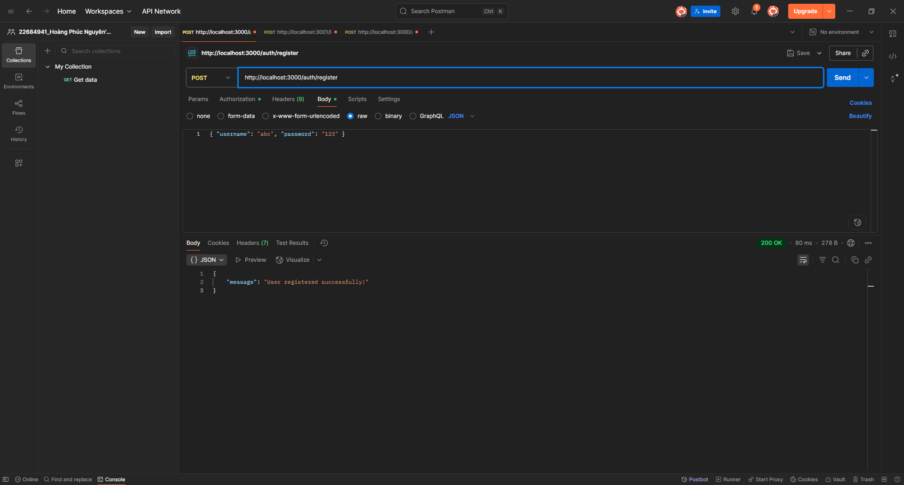
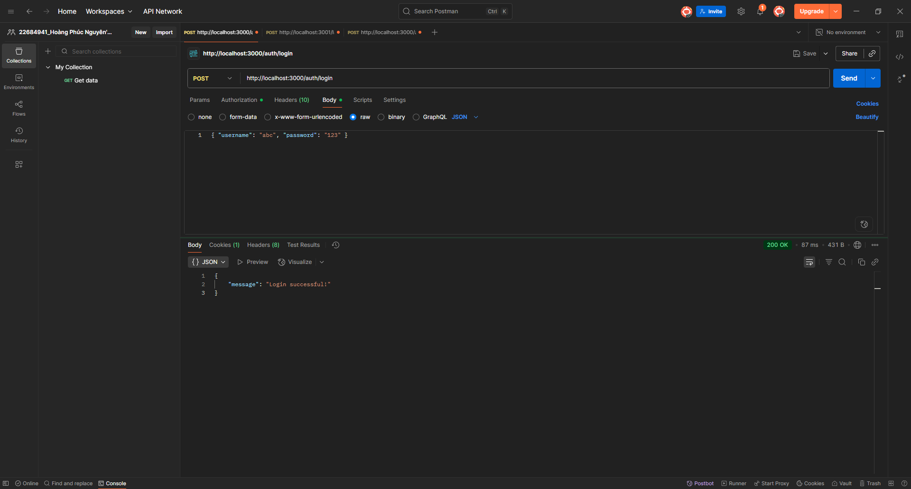
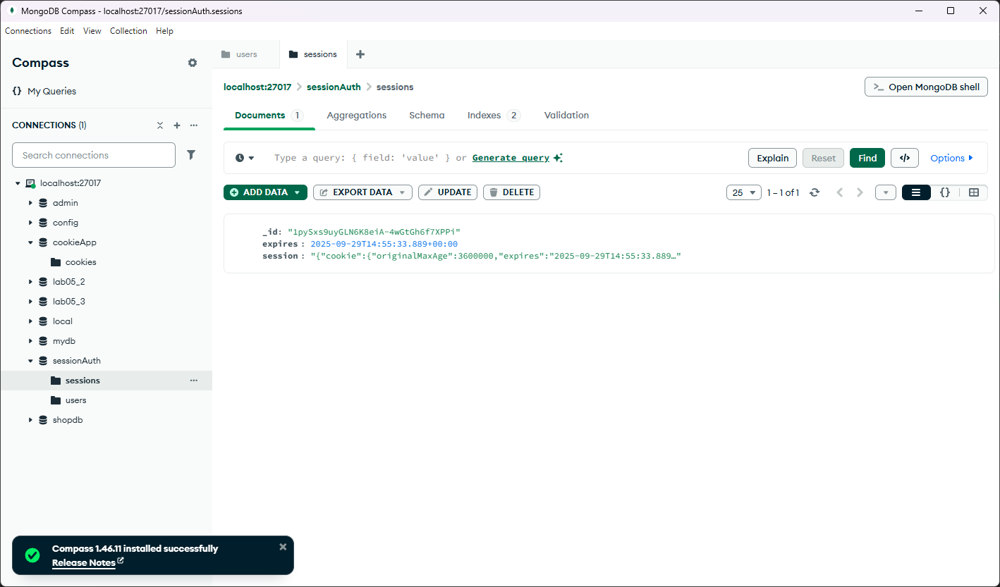
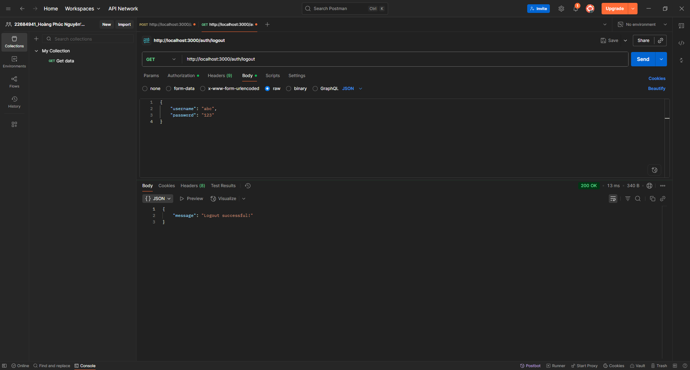
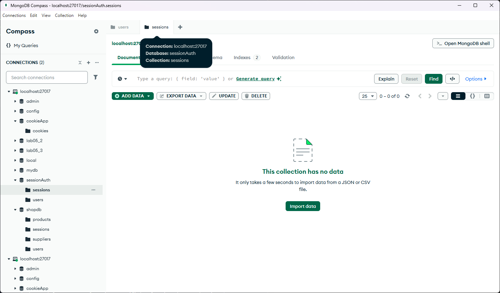
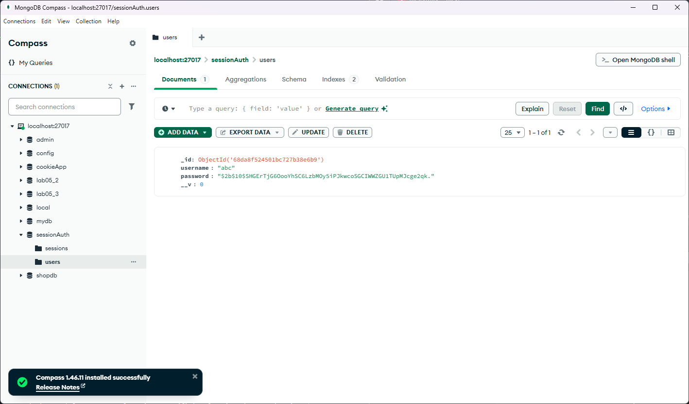

Cookie Session Auth
Giới thiệu

Dự án này sử dụng session + cookie để xác thực và lưu trạng thái người dùng trong NodeJS. Người dùng có thể đăng ký, đăng nhập, truy cập profile, đăng xuất và quản lý session trong MongoDB.

Cách chạy

Cài dependency:

npm install

Chạy project:

node cookie_auth.js

Hướng dẫn test

Register → tạo user mới, kiểm tra trong database.

Login → đăng nhập, server tạo session và trả cookie.

Profile → truy cập thông tin user bằng session cookie.

Logout → đăng xuất, cookie/session bị xóa.

Kiểm tra DB → xác minh user và session trong MongoDB.

Kết quả test:
### 1. Register

### 2. Login

### 3. Login Session Cookie

### 4. Profile

### 5. Logout

### 6. Logout Session Cookie

### 7. User trong MongoDB
